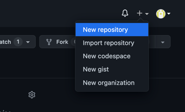
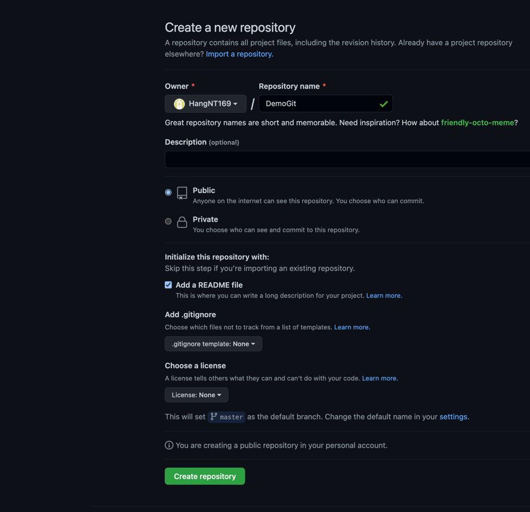
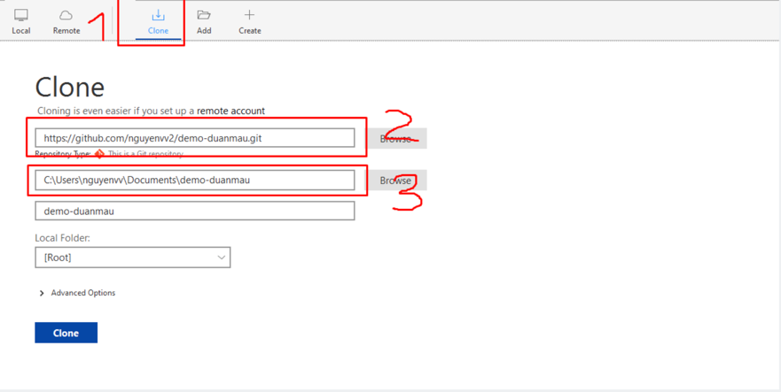
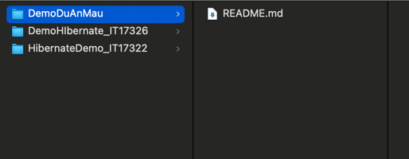
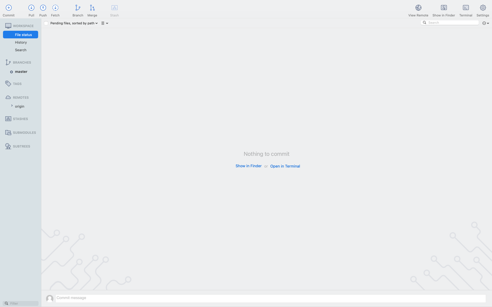
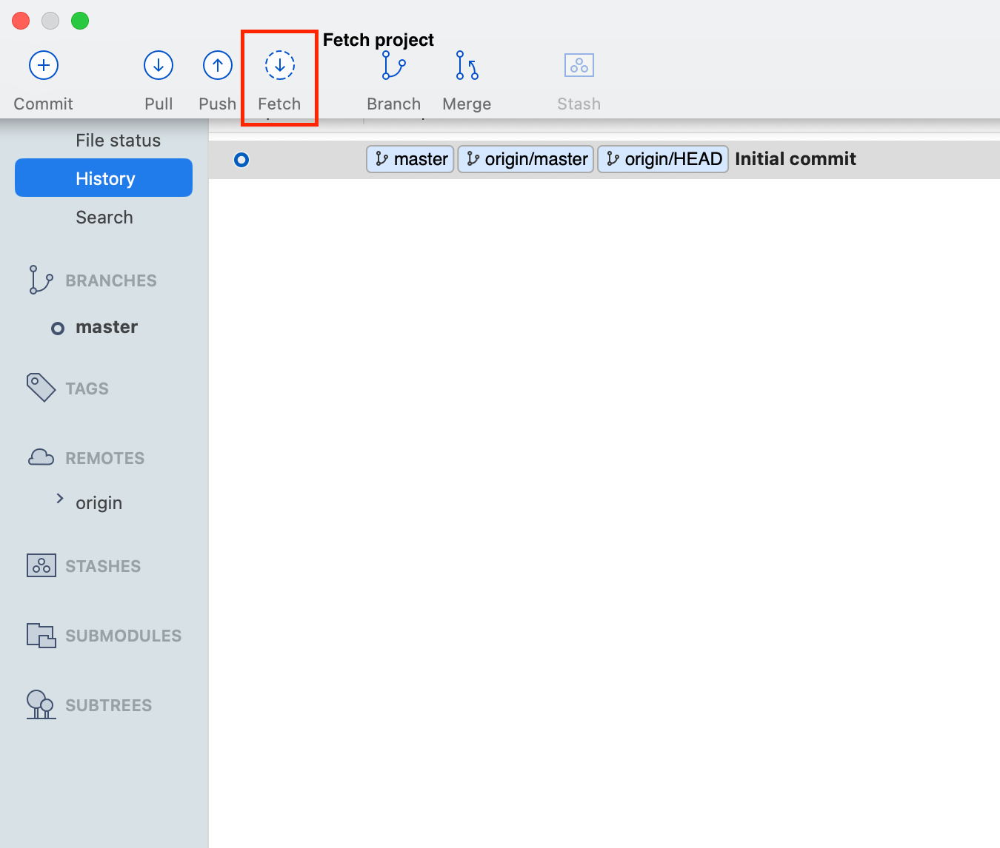
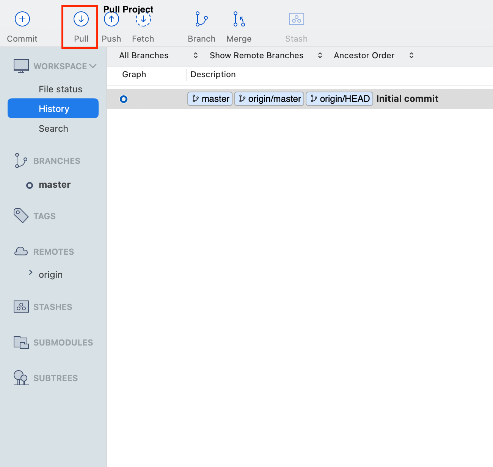
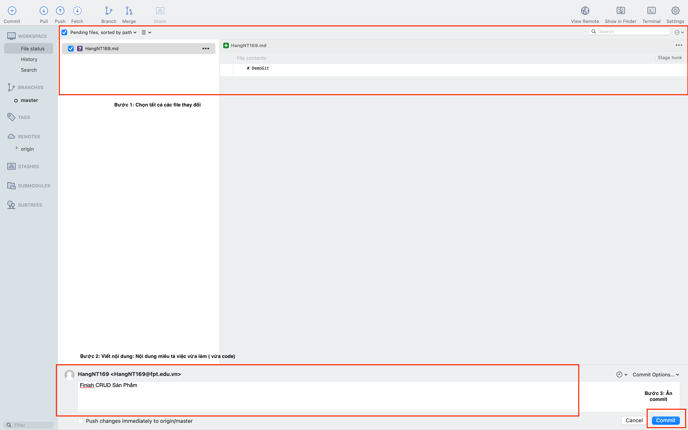
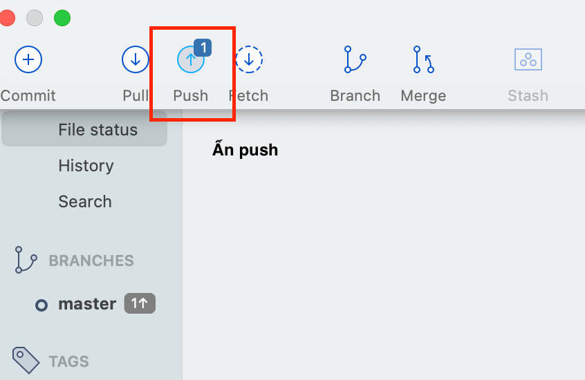

# 1. Huớng dẫn sử dụng git cơ bản bản

## Bước 1: Tạo repository trên git 

## Bước 2: Clone project với source tree 

### Sau khi clone project 
Sau khi clone xong chúng ta sẽ có 1 project được lưu ở local (máy tính cá nhân) ở thư mục mà chúng ta điền ở bước 2. 

Giao diện trên máy local 

Giao diện trên source tree 

## Bước 3: Fetch 
 => Để lấy mọi thứ mới nhất trên remote ( trên git)

## Bước 4: Pull 
=> Để update mọi thứ mới nhất trên remote về local 

## Bước 5 : Commit  
=> Sau khi fetch và pull xong thì các bạn tiến hành code 
=> Sau khi code => Quay lại source tree và add những file các bạn vừa thay đổi vào 

## Bước 6: Push code

# Notes:
- Sau khi ấn push quay lại trình duyệt xem code mới đã được up lên chưa
- Code trên trình duyệt chỉ thay đổi khi ấn push. Khi mới commit => Code mới chưa được cập nhập

