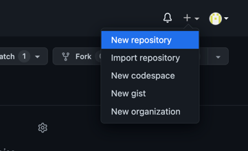
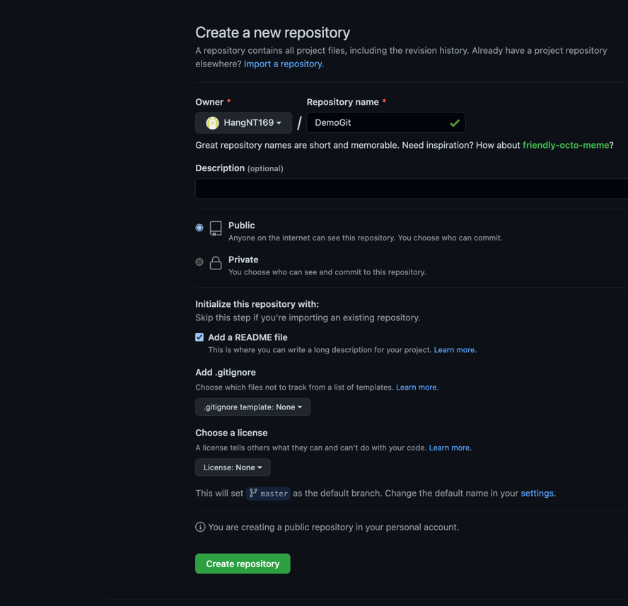
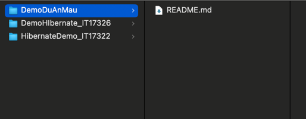
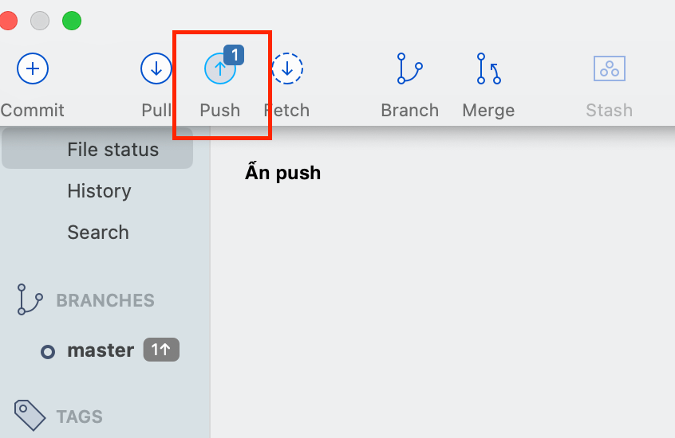

# 1. Huớng dẫn sử dụng git cơ bản bản

## Bước 1: Tạo repository trên git 

## Bước 2: Clone project với source tree 

### Sau khi clone project 
Sau khi clone xong chúng ta sẽ có 1 project được lưu ở local (máy tính cá nhân) ở thư mục mà chúng ta điền ở bước 2. 

Giao diện trên máy local  
  

Giao diện trên source tree  
  

## Bước 3: Tạo nhánh cho mình code
  
  
   

## Bước 4: Fetch 
 => Để lấy mọi thứ mới nhất trên remote ( trên git)

## Bước 5: Pull 
=> Để update mọi thứ mới nhất trên remote về local 

## Bước 6: Checkout sang nhánh của mình

## Bước 7 : Commit  
=> Sau khi fetch và pull xong thì các bạn tiến hành code 
=> Sau khi code => Quay lại source tree và add những file các bạn vừa thay đổi vào 

## Bước 8: Push code

# Notes:
- Sau khi ấn push quay lại trình duyệt xem code mới đã được up lên chưa
- Code trên trình duyệt chỉ thay đổi khi ấn push. Khi mới commit => Code mới chưa được cập nhập

# 2. Các câu lệnh git cơ bản 
### clone - copy source về máy  
### pull - kéo code về máy(sau khi đã clone)   
### add - lưu các file thay đổi  
### commit - mô tả các file thay đổi  
### push - đẩy các file đã mô tả lên repository   
### check-out - chuyển sang nhánh khác để code   

# 3. Hướng dẫn đưa 1 project java lên git  
### Làm từ bước 1,2 
### Sau bước 2 thì tạo 1 project java mới trên máy local 
  
 
Sau đó copy source code từ project java vừa tạo sang project reponsitory vừa lấy từ git về và chuyển tới bước 7   
Đây là kết quả cuối cùng trên git  
 

